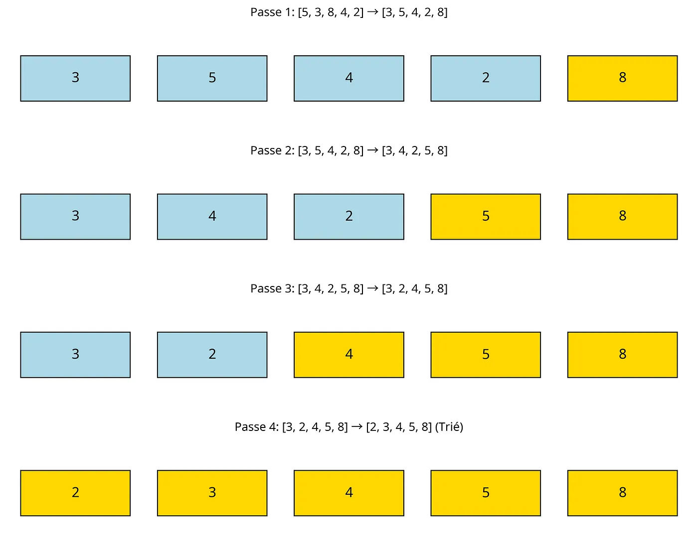

# 🧼 Bubble Sort

**Bubble Sort**, ou **Tri à bulles** en français, est un algorithme de tri simple qui fonctionne en parcourant plusieurs fois une liste, en comparant les éléments adjacents et en les échangeant s'ils sont dans le mauvais ordre.  
C'est un algorithme pédagogique mais peu efficace pour les grandes données.

## ⚙️ Fonctionnement

---

## 📈 Complexité

| Cas              | Complexité |
|------------------|------------|
| Meilleur cas     | O(n)       |
| Moyen cas        | O(n²)      |
| Pire cas         | O(n²)      |
| Mémoire          | O(1)       |

---

## 📂 Langages disponibles

Ce snippet est disponible dans les langages suivants :

- ✅ Python
- ✅ JavaScript

## 📎 Article sur le sujet

Pour en savoir plus sur l'algorithme de tri à bulles, consultez notre article détaillé :
[Le tri à bulles en JavaScript : Principes et implémentations](https://medium.com/codestation-blog/le-tri-%C3%A0-bulles-en-javascript-principes-et-impl%C3%A9mentations-9d4b68c23d92)